

        <a href="#planningPoker"><b>Planning Poker</b></a> &nbsp |&nbsp &nbsp
        <a href="#sprintreview"><b>Sprint Review</b></a> &nbsp |&nbsp &nbsp
        <a href="#equipe"><b>Equipe</b></a> &nbsp |&nbsp &nbsp
        <a href="#documentacao"><b>Documentação</b></a> &nbsp |&nbsp &nbsp
        <a href="#design"><b>Design</b></a> &nbsp |&nbsp &nbsp
        <a href="#frontend"><b>Front-end</b></a> &nbsp |&nbsp &nbsp
        <a href="#metricas"><b>Métricas do Time</b></a> &nbsp |&nbsp &nbsp
        <a href="#links"><b>Links Úteis</b></a>
    

    
## Objetivos Sprint (Backlog)
        

 🔴 **Prioridade Alta:** Inserção do conteúdo 
 🔴 **Prioridade Alta:** Finalização do repositório
 🔴 **Prioridade Alta:** Finalização do HTML do site 
 🔴 **Prioridade Alta:** Finalização do Design CSS 
 🔴 **Prioridade Alta:** Revisão do produto final 
 🟡 **Prioridade Média:** Finalização da avaliação em Javascript

        
## Planning Poker

- Após ter sido feita a revisão do Backlog e avaliação das dificuldades de cada tarefa, foi mantido o padrão do planning poker usado na Sprint 2, no qual, as dificuldades das tarefas que foram definidas como, superior ou igual a oito, foram reorganizadas e subdivididas em novas tarefas menores, as quais também utilizaram a técnica do planning poker. 
        
<figure>

## Sprint Review

- Na apresentação da segunda Sprint, foi feito um levantamento das pontuações gerais de todos os grupos, e mesmo a equipe Terra não tendo sido pontuada especificamente nessa apresentação, foi importante analisar as avaliações de todas as equipes como um todo, pois os comentários das demais, puderam ser utilizados para melhorias no processo da equipe Terra.

<figure>
    
## Sprint Planning Meeting

- Após o review da segunda Sprint, os colaboradores responderam a um questionário no Google Forms apontando as dificuldades e dando sugestões para a Sprint 3 (atual).
        
<figure>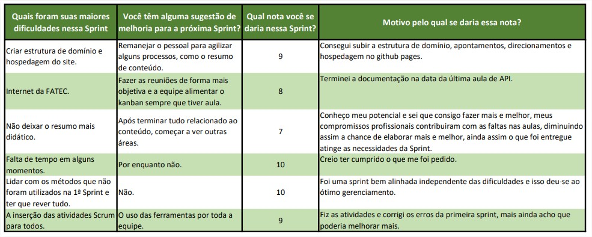   
        
→ [Voltar ao topo](#topo)        
    
## Mudanças

- Após a reunião da Sprint Review referente a segunda sprint (04/05/2023), saída de dois integrantes do time e definição das dificuldades encontradas na segunda sprint, as funções foram remanejadas para a terceira sprint de forma a continuar a qualidade e cumprimento dos prazos propostos.
    

## Equipe

- A divisão da equipe foi refeita devido a redução de integrantes da equipe, ficando três integrantes cuidando do front-end, uma pessoa cuidando do design, uma pessoa cuidando da documentação e auxiliando no detalhamento do conteúdo, além do Product Owner e do Master.

## Documentação

- Na parte da documentação para a terceira sprint, a mesma foi feita utilizando as anotações das atividades que cada integrante foi alimentando no Kanban, dentro do card ao qual estava trabalhando, facilitando, tanto o processo da documentação, quanto a visualização de cada integrante na respectiva atividade.
                       
<figure>
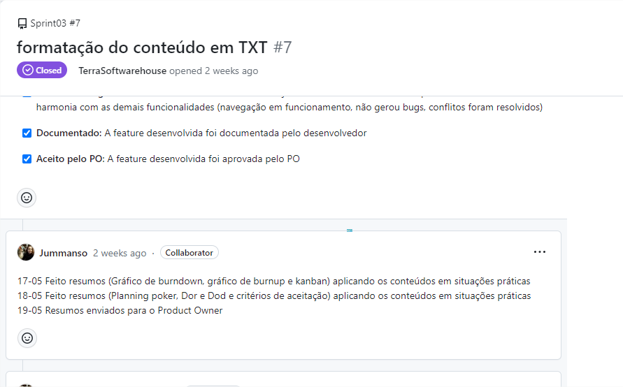           
        
<figure>
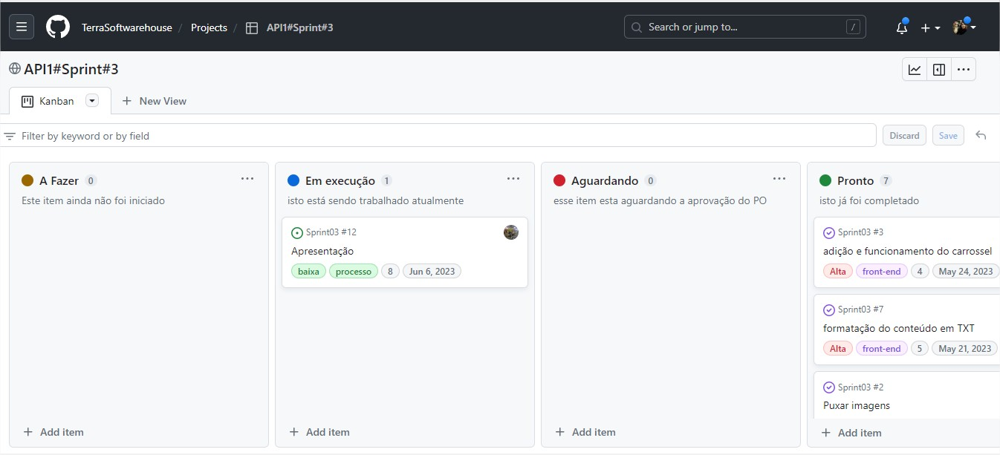           

→ [Voltar ao topo](#topo)

## Design

- O responsável pelo design coletou e inseriu as imagens em arquivo no formato PNG. Após, foram inseridas e editadas as imagens principais e de apoio, referentes aos conteúdos "O que é Scrum" até "Os benefícios do Framework". Após, foi feita a inserção das imagens dos módulos.

<figure>
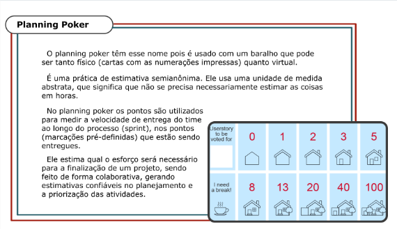 
        

## Front-end

- A equipe de front colocou o carrossel e fez os testes para verificação do funcionamento do mesmo nas páginas dos módulos. 
        
<figure>
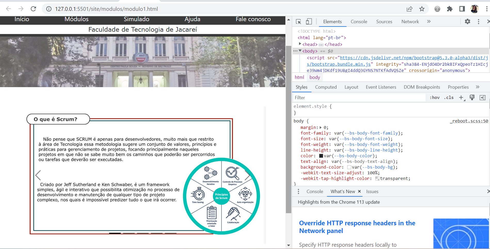         
        
- Nos módulos foi feita a inserção do conteúdo e na página inicial "index.html" foi feita a atualização da descrição e nome dos módulos.
        
<figure>
         
                
                  
- Foi implementada a mensagem negativa caso o usuário não atinja a pontuação mínima (de 6 pontos) necessária para receber o certificado.

 <figure>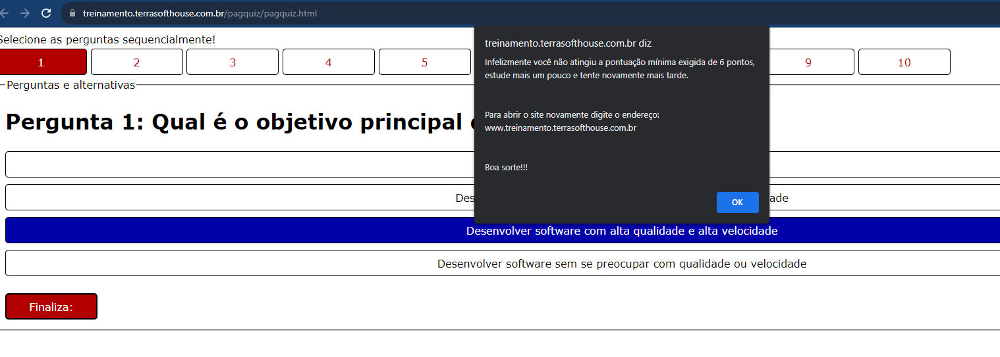

- Foi acrescentado um timer na avaliação para o usuário ter noção do tempo que levará para fazer o teste.
         
 <figure>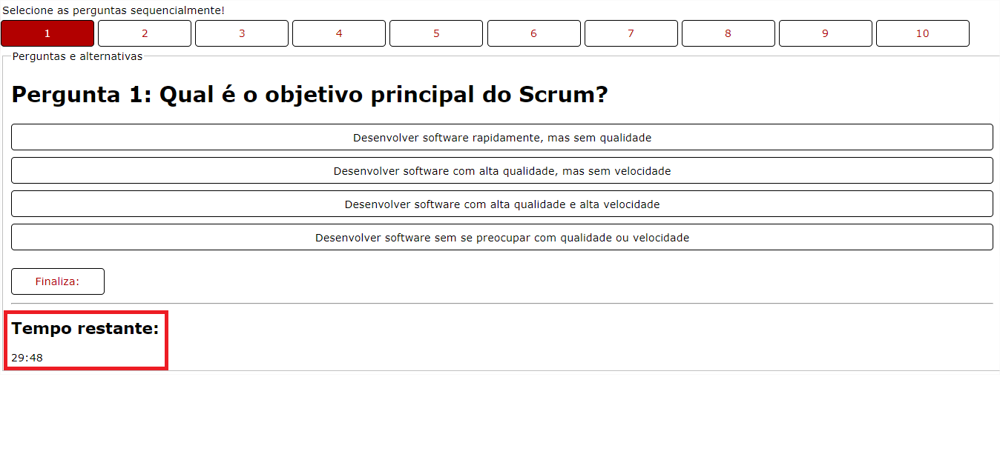        
        
- O Certificado que os usuários vão receber foi refeito, visando deixá-lo com um ar mais empresarial.

<figure>

<figure>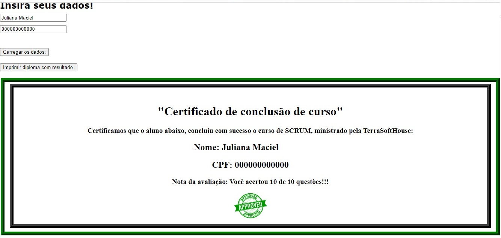

- Após concluir a prova e tirar a nota mínima suficiente de seis pontos, até a nota máxima de dez pontos, o usuário acessará a tela para efetuar a impressão do certificado após digitar o nome e o CPF (Campo esse que já está pronto para receber os dados do CPF com o usuário apenas digitando os números), e após os dados aparecerem, e o mesmo clicar no botão "imprimir diploma com resultado", o certificado ficará disponível para salvamento/impressão conforme abaixo:

<figure>

→ [Voltar ao topo](#topo)        
        
- Após a entrega total do conteúdo na terceira sprint, foi percebido que faltavam muitos pontos importantes para serem destrinchados antes da inserção final no site. Devido a isso, foi pedido um conteúdo adicional com explicações mais simples, e modificações no conteúdo mais técnico, gerando alterações até próximo a finalização da terceira sprint.        
        
- Esse conteúdo adicional foi desenvolvido, aplicando os conceitos com exemplos práticos de forma a colocar mais de uma opção/ forma de aprendizado para os usuários que forem utilizar o site e os mesmos foram aplicados no módulo quatro. 
        
<figure>
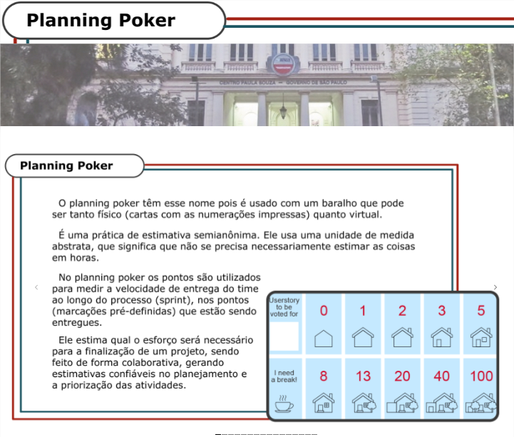

- Conteúdo entregue ao Product Owner:    
        
<figure>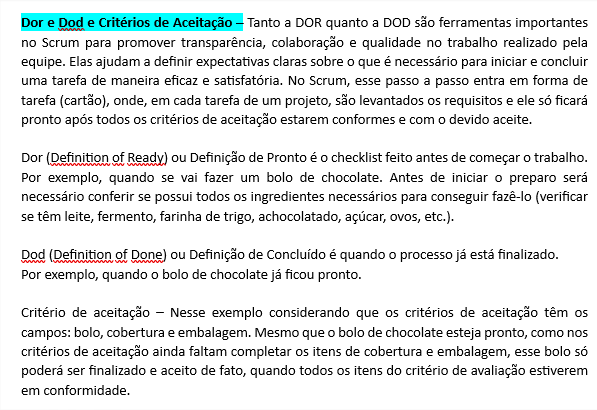
        
- Conteúdo incluso no site pela equipe de front-end, após aprovação do Product Owner.
        
<figure>
           
 
- Foi criado o site da empresa, e a hospedagem foi feita na estrutura da Locaweb, a equipe terminou a inserção do conteúdo e após, iniciaram-se os testes para verificar o funcionamento e possíveis ajustes.
             
        
- Pensando na acessibilidade dos usuários, nos módulos foram inclusos áudios e um avatar fazendo a linguagem de sinais, de forma a atender ao máximo de pessoas que precisem utilizar o site e fazer o treinamento.      
        
- Abaixo, têm-se um exemplo de um módulo com o áudio e clicando no símbolo da telebobina (símbolo escolhido por ser o símbolo universal dos deficientes auditivos), abre-se o avatar fazendo as libras do conteúdo.        
                
        
<figure>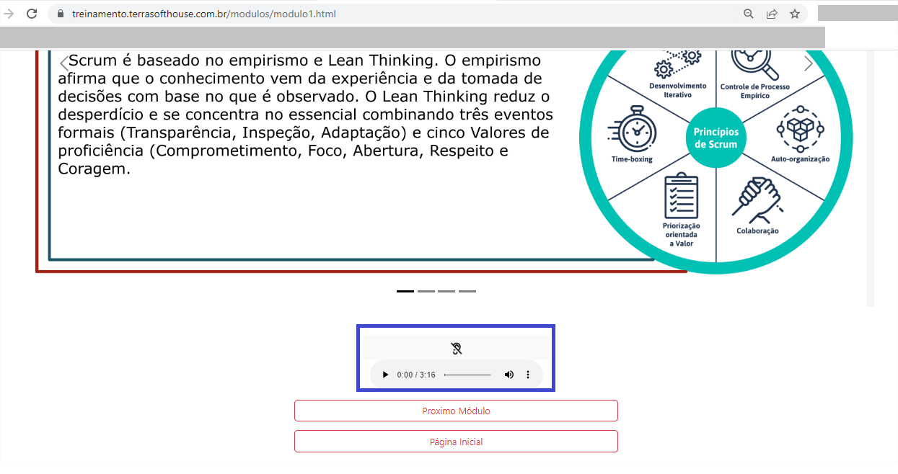   
        
<figure>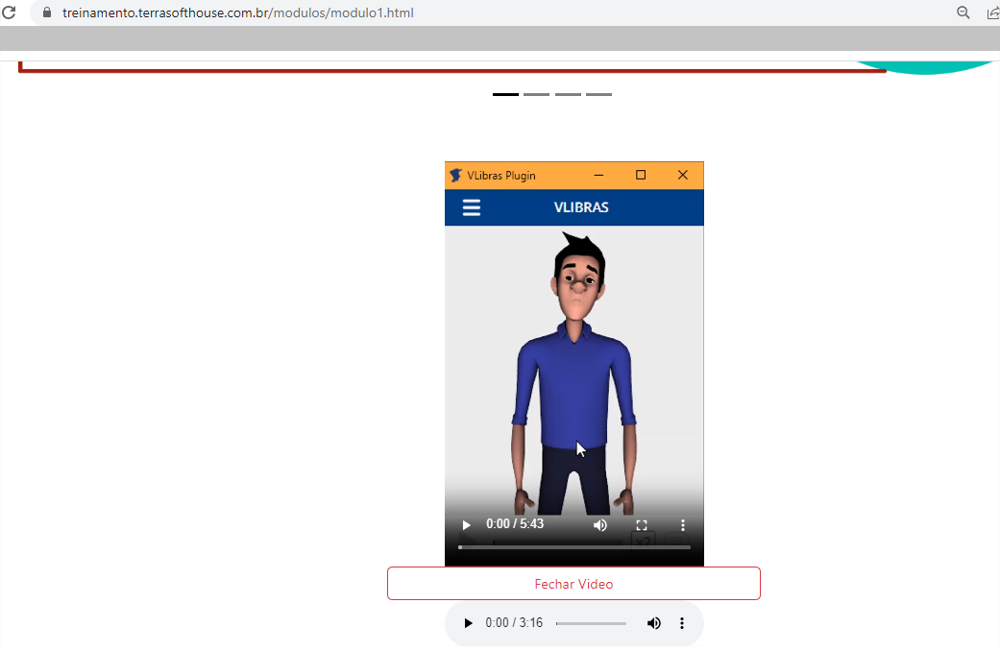          
        
- Durante os testes sobre o funcionamento do site, verificou-se erros gramaticais nos textos e falha no funcionamento do carrossel, todos esses erros foram corrigidos no decorrer da terceira sprint. Após os testes, revisão e ajustes necessários o <a href="https://treinamento.terrasofthouse.com.br/"><b>site</b></a> ficou pronto para entrega e utilização do cliente.    
        
<figure>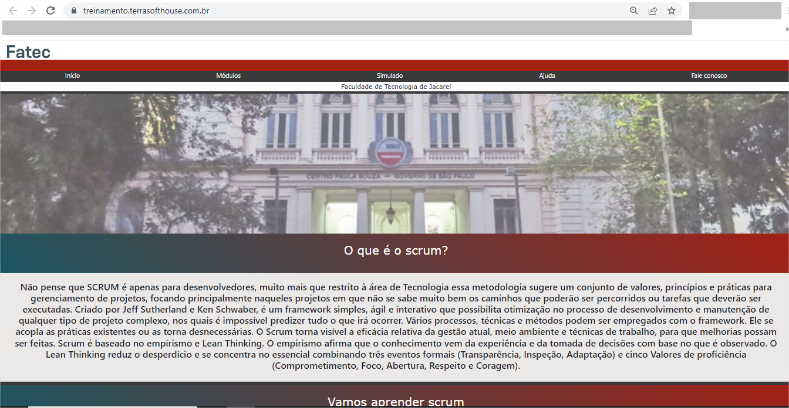            
        
- O Master trabalhou na apresentação para o cliente e convidados, enquanto a equipe trabalhou no desenvolvimento dos QR Codes para serem utilizados na apresentação e facilitar, o acesso dos convidados aos conteúdos do site da empresa Terra Softhouse e o site de Treinamento Scrum.

<figure>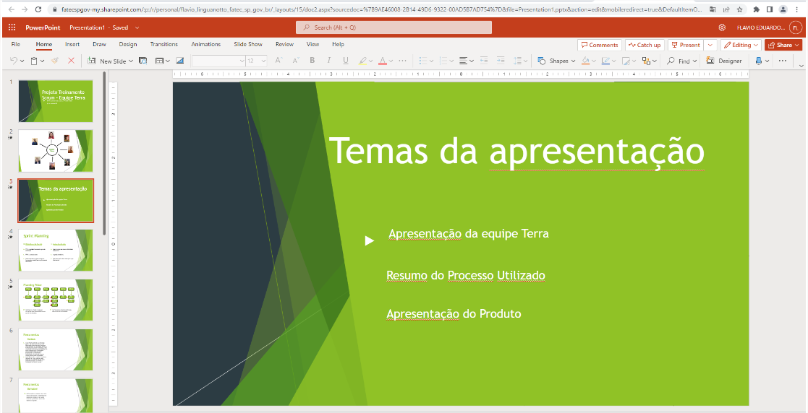        
        
<figure>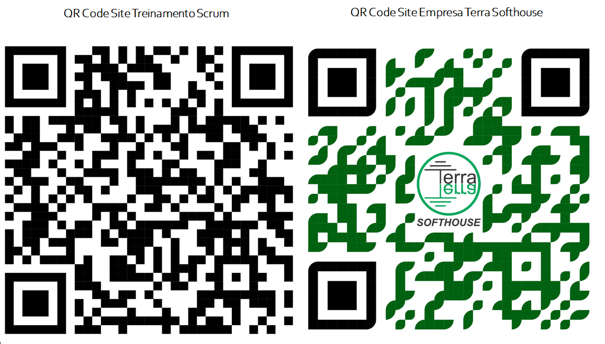         
        
- Após a montagem da apresentação foi feito um controle adicional pelo kanban, onde os membros assistiram a uma pré apresentação feita pelo Master e puderam pontuar e detectar erros na mesma, a tempo de tudo ser corrigido antes da entrega do produto final ao cliente.
        
<figure>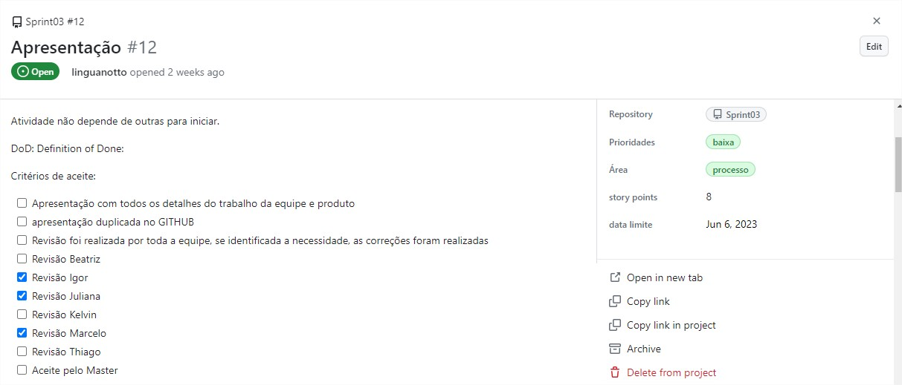   
        
        
→ [Voltar ao topo](#topo)

        

## Métricas do Time

<b>Controle Presença</b>

- O Controle de Presença foi mantido com o objetivo de a equipe visualizar quanto tempo faltava para terminar o prazo e se reorganizar, caso necessário, a fim de cumprir as atividades dentro do prazo.

<figure>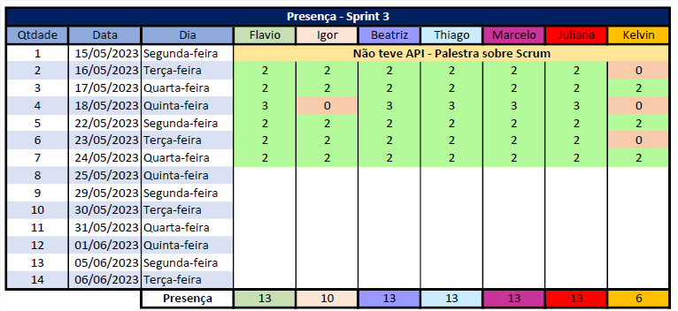

<b>Histórias de usuários (User Stories)</b>

- Abaixo as Histórias de usuários (User Stories) feitas com o intuito de atender as expectativas dos envolvidos na avaliação do projeto.
        

        
<figure>

        
<b>Burndown</b>

Gráfico de Burndown da data de 06/06/2023.

<figure>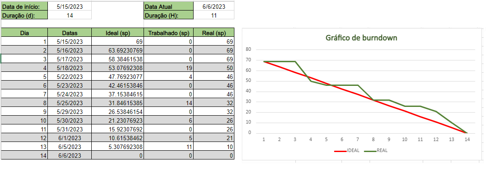

# Links Úteis

😏 Site do projeto: <a href="https://treinamento.terrasofthouse.com.br/"><b>https://treinamento.terrasofthouse.com.br/</b></a>

😀 Repositório do site: <a href="https://github.com/TerraSoftwarehouse/Projeto-Treinamento-Scrum/tree/ajustes-site/site"><b>https://github.com/TerraSoftwarehouse/Projeto-Treinamento-Scrum/tree/ajustes-site/site</b></a>.

🙃 Repositório da API (Sprint3): <a href="https://github.com/TerraSoftwarehouse/Sprint03"><b>https://github.com/TerraSoftwarehouse/Sprint03</b></a>

🧐 Kanban (Sprint3): <a href="https://github.com/users/TerraSoftwarehouse/projects/2"><b>https://github.com/users/TerraSoftwarehouse/projects/2</b></a>

😎 Site empresa Terra Softhouse: <a href="https://terrasofthouse.com.br/"><b>https://terrasofthouse.com.br/</b></a>

→ [Voltar ao topo](#topo)
