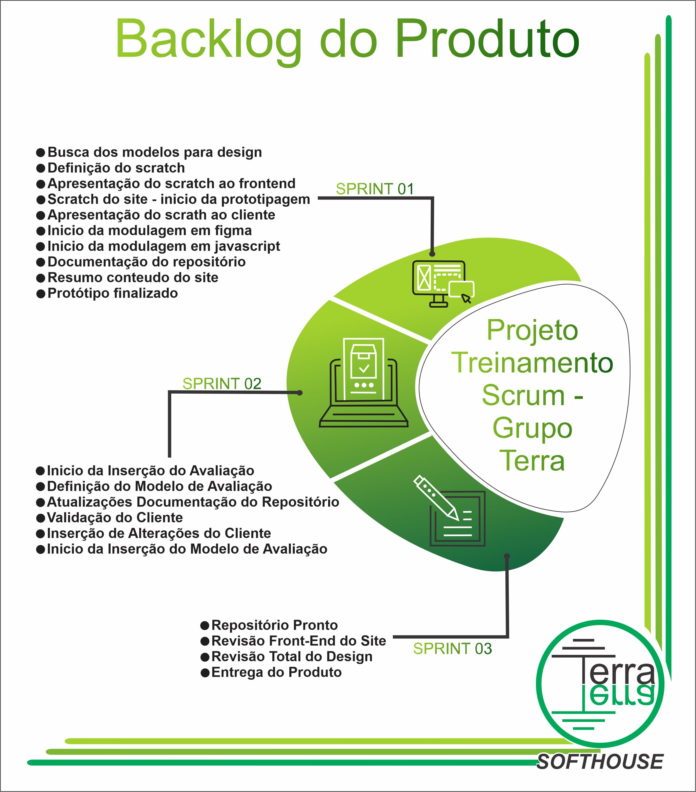
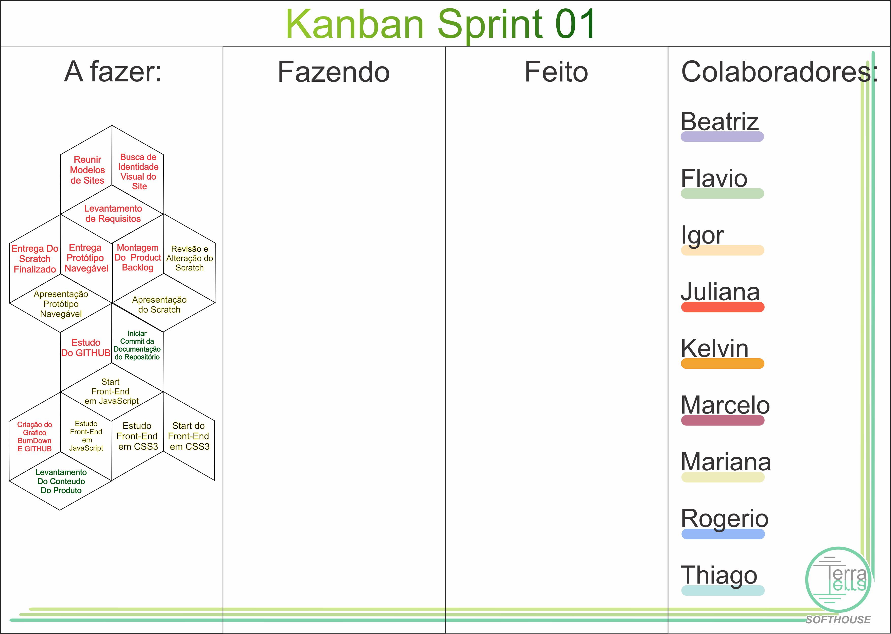
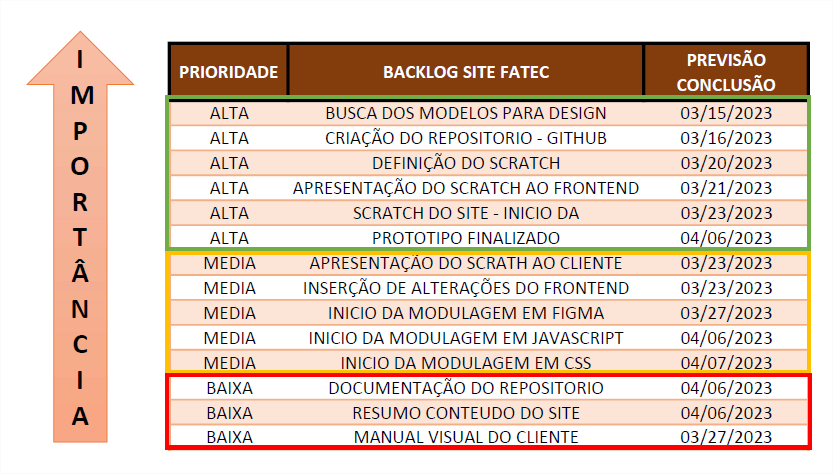
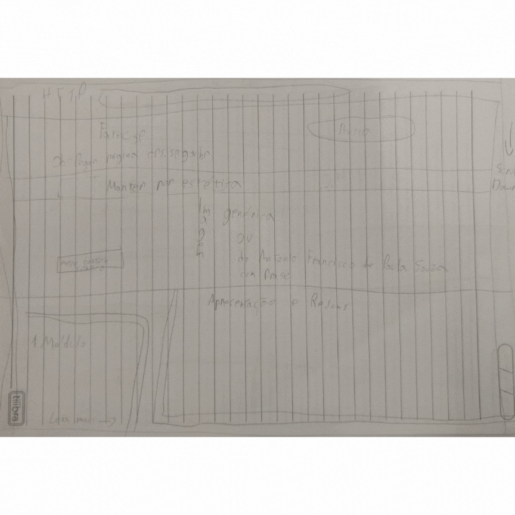
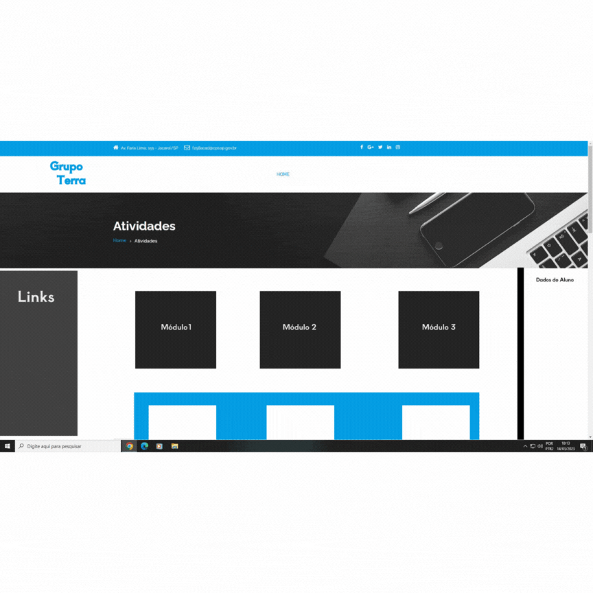
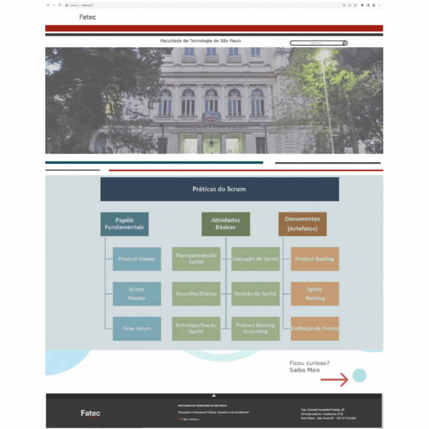

<h1 align="center">Documentação - Sprint1</h1>
<h1>1. Introdução </h1>

<h2>1.1	Descrição</h2>

<h3 text-align="justify">Sistema web mostrando os processos e artefatos da metodologia ágil Scrum com formulário de avaliação.</h3>
 
<h2>1.2	Objetivo</h2>
<h3  text-align="justify">Demonstrar ao usuário a metodologia Scrum de forma que o mesmo possa replicar todos os passos em futuros desenvolvimentos.</h3>
 
<h1>2. Desenvolvimento </h1>
<h2>2.1	Tecnologias utilizadas</h2>
<h3>2.1.1	Tecnologias front-end</h3>
<li>JavaScript, HTML, CSS e Figma.</li>
 
<h3>2.1.2	Tecnologias para versionamento e comunicação</h3>
<li>Github e VS Code.</li>
 
<h3>2.1.3	Tecnologias para gerenciamento do time</h3>
<li>Microsoft Teams, trello e grupo privado whats app.</li>

<h2>2.1.4	Levantamento de requisitos</h2>

Foram efetuados esboços simples desenhados a mão para se ter uma ideia inicial do que seria feito no desenvolvimento do site. Após, o Project Owner se reuniu com o cliente apresentando esses esboços e a partir daí pôde definir quais seriam os próximos passos para o planejamento das Sprints.

<h2>2.1.5	Planejamento das sprints</h2>

<h3>2.1.5.1	Backlog Sprints</h3>

Após perceber a necessidade do cliente o Product Owner fez o Backlog do Produto com as atividades para a execução do produto solicitado.

<figure>
<figcaption>Backlog do Produto</figcaption>
</figure>

<h3>2.1.5.2	Sprint 1</h3>

<text-align="justify">Foi utilizado o gráfico de burndown para estimar o tempo necessário para a conclusão de cada atividade e dessa forma foi possível efetuar o monitoramento das atividades. Apesar de, a ferramenta permitir a visão global do projeto de forma a realocar os integrantes de acordo com a demanda de cada atividade, esse recurso não foi utilizado na primeira sprint pois a divisão das tarefas acabou ficando de acordo com o planejamento.</text-align>

    <figure>
        <figcaption>Gráfico de Burndown</figcaption>
    </figure>
    

<text-align="justify"> A partir da criação do Product Backlog foi possível desmembrar as funções, organizá-las em ordem de prioridade e efetuar a criação do Kanban no Trello, o qual, foram atribuídas cores a cada colaborador de forma a melhorar o controle das atividades e visualização das responsabilidades.</text-align>

<figure>
    <figcaption>Kanban-Definição cores</figcaption>
    

    

    <figcaption>Kanban-Início Trello</figcaption>
</figure>

A primeira sprint foi feita considerando os requisitos, prazos e ordem de prioridade.

<figure>
    <figcaption>Backlog-Sprint1</figcaption>
</figure>  

  

<h2>2.1.6	Desenvolvimento do site</h2>
Para o desenvolvimento do site, primeiramente foi validado o mockup, o qual, foi desenvolvido com base nas cores e fontes utilizadas no site do próprio cliente <a href="http://www.fatecsp.br"><b>(FATEC).</b></a>

 
<figure>
 Características das cores</figcaption>
</figure>

Depois de definir as cores e fontes, foram conduzidos os processos de criação do protótipo.  A princípio, o esboço foi feito de forma manual, sendo estruturado depois com as definições de layout. 
<figure>

</figure>

A versão 1 do site ficou pronta após ter sido feita a inclusão e disposição de cada conteúdo na interface:
<figure>
    

Versão 2 do site:
<figure>
    

 

Protótipo navegável:
<figure>
    

<h2>2.1.7	Dificuldades</h2>
<text-align="justify">Em relação as dificuldades destacam-se a falta de conhecimento das ferramentas e a principal dificuldade encontrada na Sprint 1 foi em relação ao uso do Git Hub. Como solução temporária, esse controle foi feito pelo Trello e anotações das reuniões diárias (Daily Scrum). Buscando a solução, foram feitos levantamentos das dificuldades de cada integrante, a busca de estudo para solucionar as dificuldades, estudos sobre o Git Hub, alinhamento com os colegas, professores, buscando materiais complementares e como decisão, após conhecer melhor a ferramenta, o Kanban deixou de ser usado no Trello para, a partir da Sprint 2 ser usado direto no Git Hub.</text-align>

<h2>2.1.8	Sprint Review </h2>
Confira aqui o detalhamento da Reunião da <a href= "https://github.com/TerraSoftwarehouse/Documentacao/tree/Sprint%231"><b>Sprint Review</b></a> efetuada no dia 13/04/2023.

<h1>3. Conclusão </h1>
<text-align="justify">Processo extremamente enriquecedor, aonde buscamos o conhecimento além da sala de aula, adquirimos visão de mercado e melhoria no trabalho e tomada de decisões em conjunto.</text-align>

