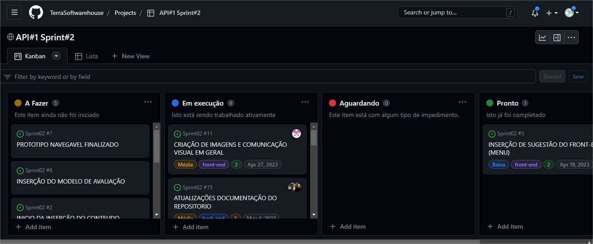

    

        <a href="#objetivos"><b>Objetivos</b></a> &nbsp |&nbsp &nbsp
        <a href="#sprintreview"><b>Sprint Review</b></a> &nbsp |&nbsp &nbsp
        <a href="#equipe"><b>Equipe</b></a> &nbsp |&nbsp &nbsp
        <a href="#documentacao"><b>Documentação</b></a> &nbsp |&nbsp &nbsp
        <a href="#design"><b>Design</b></a> &nbsp |&nbsp &nbsp
        <a href="#frontend"><b>Front-end</b></a> &nbsp |&nbsp &nbsp
        <a href="#metricas"><b>Métricas do Time</b></a> &nbsp |&nbsp &nbsp
        <a href="#links"><b>Links Úteis</b></a>
    

    

## Objetivos Sprint (Backlog)

 🔴 **Prioridade Alta:** Início da formatação do conteúdo
 🔴 **Prioridade Alta::** Definição do modelo de avaliação
 🟡 **Prioridade Média:** Atualização da Documentação no Repositório
 🟡 **Prioridade Média:** Finalização do protótipo navegável
 🟢 **Prioridade Baixa:** Inserção de Sugestão do Front-end (Menu)
 🟢 **Prioridade Baixa:** Inserção do Modelo de Avaliação

## Planning Poker

A técnica do Planning Poker foi utilizada nessa Sprint após ter sido efetuada uma revisão do backlog e feita uma avaliação das dificuldades de cada tarefa, obtendo uma estimativa precisa do esforço que seria necessário.
As tarefas com dificuldades superior ou igual a oito foram reorganizadas e subdivididas em novas tarefas menores, de forma a melhorar a eficiência e a entrega de forma mais ágil, a técnica do Planning Poker também foi utilizada nessas subdivisões, fazendo com que, o tempo de execução das atividades fosse feito de forma mais precisa e refinada até a finalização da Sprint 2.

<figure>

## Sprint Review

Foram feitas as anotações referente a avaliação do grupo na apresentação da Sprint1 de forma a ficar clara as pontuações para todos os integrantes e serem aplicadas as devidas correções.

<figure>

 Após a reunião da Sprint Review referente a Sprint I (13/04/2023) e definição das dificuldades encontradas na primeira sprint, foi decidida a mudança do Kanban do trello para o Git Hub.

<figure>

Dentro de cada tarefa foram inseridas as devidas prioridades.

<figure>

## Equipe

A divisão da equipe foi feita separando inicialmente duas pessoas para a documentação, três pessoas para o front-end, uma pessoa cuidando do conteúdo do site e uma pessoa cuidando do design, além do Product Owner e do Master.
 No decorrer da Sprint, uma pessoa foi retirada da documentação e alocada como apoio tanto ao master, quanto no desenvolvimento do site da empresa Terra Softhouse. 
 E já no final da sprint, o design após o término das respectivas atividades, também foi realocado para auxiliar na parte do conteúdo do site. 

## Documentação

Além da documentação padrão, a equipe de documentação trabalhou no site da empresa Terra, utilizanzo DoR - Definiton of ready (Critérios necessários para que uma história possa ser iniciada) e DoD - Definition of Done (Critérios para considerar uma história como concluída), visando vivenciar na prática a experiência de empresa como um todo.
                       
<figure>
                       

 Conheça aqui o site da <a href="https://terrasofthouse.com.br/"><b>Terra Softhouse</b></a>.

## Design

A equipe de design iniciou a busca por referências de páginas de apresentação de equipes, plataformas de apresentação de conteúdos esteticamente agradáveis e referências de formatos adaptáveis de Layout para as apresentações.
Após, foi feito o desenvolvimento do primeiro modelo para a página de apresentação da equipe.

## Front-end

Foi feita uma pesquisa para deixar o site responsivo e o início dos testes usando o bootstrap.
<b>A equipe de front encontrou dificuldade no uso do bootstrap e focou no estudo do mesmo para dar continuidade no processo.</b>  Foram feitos os ajustes do CSS e tela principal e os ajustes dos módulos na página principal.

<figure>
    
A página responsiva ficou pronta e foram adicionados os links, ficando preparada para receber o conteúdo.

<figure>
    
<figure>

O layout da página de avaliação foi finalizado com bootstrap, deixando o mesmo preparado para receber o conteúdo.

<figure>

## Métricas do Time

<b>Controle Presença</b>

Foi feito um controle mais lúdico (utilizando as cores de cada um) de presença com o objetivo da equipe visualizar quanto tempo faltava para terminar o prazo e se reorganizar, caso necessário, a fim de cumprir as atividades dentro do prazo.

<figure>

<b>Histórias de usuários (User Stories)</b>

As Histórias de usuários (User Stories) foram feitas com o intuito de atender as expectativas dos envolvidos na avaliação do projeto.

<figure>

<b>Burndown</b>

Colocar Burndown do dia 04/05/2023.

<b>Links Úteis</b>

😏 Site do projeto: <a href="https://treinamento.terrasofthouse.com.br/"><b>https://treinamento.terrasofthouse.com.br/</b></a>

😀 Repositório do site: <a href="https://github.com/TerraSoftwarehouse/Projeto-Treinamento-Scrum/tree/ajustes-site/site"><b>https://github.com/TerraSoftwarehouse/Projeto-Treinamento-Scrum/tree/ajustes-site/site</b></a>.

🙃 Repositório da API (Sprint2): <a href="https://github.com/TerraSoftwarehouse/Sprint02"><b>https://github.com/TerraSoftwarehouse/Sprint02</b></a>

🧐 Kanban (Sprint2): <a href="https://github.com/users/TerraSoftwarehouse/projects/1/views/1"><b>https://github.com/users/TerraSoftwarehouse/projects/1/views/1</b></a>

😎 Site empresa Terra Softhouse: <a href="https://terrasofthouse.com.br/"><b>https://terrasofthouse.com.br/</b></a>

→ [Voltar ao topo](#topo)

